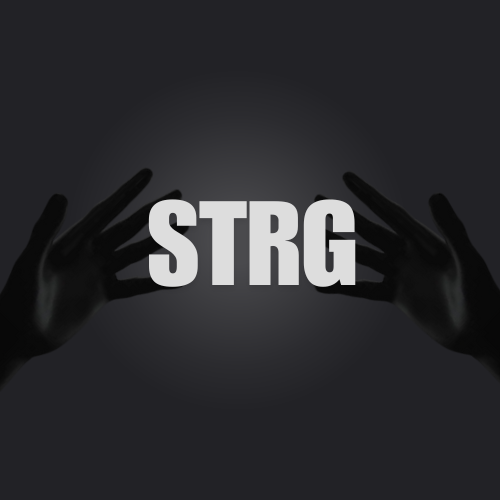

[](https://www.python.org/downloads/release/python-3100/)
[](https://www.tensorflow.org/)
[](https://opencv.org/)
[](https://mediapipe.dev/)
[](https://docs.python.org/3/library/tkinter.html)
[](https://godotengine.org/)
[](LICENSE)

<p align="center">
  
</p>

<h1 align="center">STRG - Sistema de Tradução e Reconhecimento de Gestos</h1>

<p align="center">
  <em>Um olhar inovador sobre a comunicação gestual, potenciado por inteligência artificial.</em>
</p>

<p align="center">
  <strong>Projeto PAP 2025</strong>
</p>

<p align="center">
  
</p>

## 🎯 Sobre o Projeto

### O STRG é uma solução desenvolvida em python que visa desmistificar e traduzir linguagem gestual em tempo real. Mais do que um simples tradutor, o projeto explora funcionalidades adicionais para enriquecer a interação e oferecer uma ferramenta intuitiva. Este projeto nasceu da vontade de explorar o potencial da visão computacional e machine learning.

## ✨ Funcionalidades Detalhadas por Módulo

O STRG é composto por vários módulos, cada um com funcionalidades específicas, acessíveis através do launcher principal (`STRG.py`):

1.  **Reconhecimento de Gestos (F1)**

    - Script: `src/main/main.py`
    - Descrição: Interpreta gestos manuais capturados pela câmara em tempo real. Utiliza um modelo de reconhecimento de gestos próprio.

2.  **Reconhecimento de Palavras (F2)**

    - Script: `src/main/word_recognition/word_recognition_app.py`
    - Descrição: Aplicação dedicada ao reconhecimento de palavras.

3.  **Controlo do Cursor (F3)**

    - Script: `src/utils/mouse-control-hand/mouse_control.py`
    - Descrição: Permite controlar o cursor do rato no ecrã utilizando os gestos da mão detetados pela câmara.

4.  **Controlo do Volume (F4)**

    - Script: `src/utils/volume-control-hand/main.py`
    - Descrição: Ajusta o volume do sistema operativo através de gestos específicos da mão.

5.  **Reconhecimento Facial (F5)**

    - Script: `src/utils/face-recon/face.py`
    - Descrição: Identifica ou verifica faces com base numa base de dados local.

6.  **Visão Binária (F6)**

    - Script: `src/utils/binary-vision/binary_vision.py`
    - Descrição: Aplica um threshold à imagem da câmara para criar uma visualização a preto e branco (binária).

7.  **Visualizador 3D da Mão (F7)**

    - Script: `src/utils/3d-hand-viewer/python/hand_detection.py`
    - Descrição: Deteta a mão e os seus pontos de referência (landmarks) e é usado para renderizar uma representação 3D da mão. Este script Python interage com uma game engine chamada Godot.

8.  **Menu de Performance (F8)**

    - Script: `src/utils/menus/performance-menu/performance_menu.py`
    - Descrição: Apresenta um menu para monitorizar ou ajustar parâmetros relacionados com a performance das aplicações.

## 🛠️ Tecnologias Utilizadas

- **Python 3.10:** Linguagem principal de desenvolvimento.
- **Tkinter:** Para a interface gráfica do menu principal (`STRG.py`).
- **OpenCV:** Para processamento de imagem, captura de vídeo e funcionalidades de visão computacional em vários módulos.
- **MediaPipe:** Para deteção de mãos, rosto e landmarks de forma eficiente, utilizado em módulos como o `HandTrackingModule.py` e noutros módulos de reconhecimento.
- **TensorFlow/Keras:** Para a construção, treino e utilização de modelos de Machine Learning (evidenciado pela presença de ficheiros de modelo e pastas `models/`).
- **Pynput:** Para escuta de eventos de teclado globais (atalhos F1-F8 no launcher).
- **Subprocess:** Para lançar os diferentes módulos em terminais separados.
- **Outras bibliotecas (implícitas):** `os`, `shutil`, `random`, `math`, e `pickle` para serialização de dados (ex: `face_database.pkl`).

## 🚀 Como Começar

Para pôr o STRG a funcionar no teu sistema, segue estes passos.

### 📋 Pré-requisitos

- Python 3.10.

### 🛠️ Instalação de Dependências do Sistema

Abre o teu terminal e executa os seguintes comandos para instalar as dependências essenciais.

1.  **Ferramentas de Desenvolvimento Python 3.10 (Exemplo para Fedora):**
    ```bash
    sudo dnf install -y python3.10-devel
    ```
    Para outras distribuições linux (ex: baseadas em debian/ubuntu), o comando seria algo como:
    ```
    sudo apt-get update
    sudo apt-get install -y python3.10-dev
    ```
2.  **Outras Dependências Críticas (Exemplo para Fedora):**
    Isto inclui bibliotecas essenciais para desenvolvimento Python, interface gráfica X11, emuladores de terminal (para lançar os módulos), `wmctrl` (para gestão de janelas), e o Godot Engine (se pretenderes explorar a visualização 3D).

    ```bash
    sudo dnf install -y python3-devel libX11-devel libXtst-devel gnome-terminal xterm wmctrl godot
    ```

    Para outras distribuições (ex: debian/ubuntu):

    ```
    sudo apt-get install -y python3-dev libx11-dev libxtst-dev gnome-terminal xterm wmctrl godot
    ```

### ⚙️ Configuração do Ambiente de Desenvolvimento Python

Após a instalação das dependências do sistema, é crucial configurar um ambiente virtual Python isolado para o projeto.

1.  **Clona o Repositório e Entra no Diretório:**

    ```bash
    git clone https://github.com/jdias2019/STRG.git
    cd STRG
    ```

2.  **Cria o Ambiente Virtual:**
    Recomenda-se usar o nome `venv_STRG` ou `venv_py310` como visto na estrutura do projeto.

    ```bash
    python3.10 -m venv venv_STRG
    ```

3.  **Ativa o Ambiente Virtual:**
    Este passo é necessário sempre que quiseres trabalhar no projeto.

    ```bash
    source venv_STRG/bin/activate
    ```

    O teu prompt do terminal deverá mudar, indicando que o ambiente virtual está ativo.

4.  **Atualiza o Pip:**
    Garante que tens a versão mais recente do `pip`.

    ```bash
    pip install --upgrade pip
    ```

5.  **Instala as Dependências do Projeto:**
    Este comando instala todas as bibliotecas Python no ficheiro `requirements.txt`.
    ```bash
    pip install -r requirements.txt
    ```

### ▶️ Executar o STRG (GUI)

Com o ambiente configurado e ativo, podes iniciar o menu principal do STRG:

1.  **Certifica-te que o ambiente virtual está ativo:**
    ```bash
    source venv_STRG/bin/activate
    ```
2.  **Executa o script do launcher:**
    ```bash
    python STRG.py
    ```
    Isto abrirá uma GUI, a partir da qual poderás lançar os diferentes módulos clicando nos botões correspondentes ou usando as teclas de função (F1-F8). Cada módulo será, por norma, aberto numa nova janela de terminal.

### 🤖 Como Usar os Diferentes Módulos

Após lançar `STRG.py`, a interface principal permitir-te-á iniciar cada um dos módulos descritos na secção "Funcionalidades Detalhadas por Módulo".

- **Visualizador 3D (Godot):** Para a componente de visualização 3D da mão, o script Python (`src/utils/3d-hand-viewer/python/hand_detection.py`) é o que é lançado pelo menu. Existe um projeto Godot complementar, terás de o abrir separadamente no Godot Engine:
  1.  Abre o Godot Engine.
  2.  No gestor de projetos, clica em "Importar".
  3.  Navega até à pasta do projeto Godot (ex: `src/utils/3d-hand-viewer/godot/`) e seleciona o ficheiro `project.godot`.
  4.  Abre o projeto e pressiona F5 para o executar.

### 🧠 Como Treinar os Modelos

O treino de modelos de Machine Learning é específico para certos módulos do STRG. Segue os guias detalhados para cada tipo de modelo:

#### 📋 1. Reconhecimento de Gestos (`src/main/main.py`)

Este módulo permite treinar um modelo personalizado para reconhecer gestos manuais específicos.

**Passo 1: Colectar Amostras**

1. Executa o módulo principal de gestos através do launcher ou diretamente:
   ```bash
   python src/main/main.py
   ```
2. No menu, seleciona a opção **"1 - Coletar Amostras"**
3. Define o nome do gesto que queres treinar (ex: "ola", "tchau", "ok")
4. Posiciona a tua mão na frente da câmara
5. Pressiona **ESPAÇO** para começar a gravação de uma amostra
6. Executa o gesto durante a gravação (30 frames por amostra)
7. Repete o processo várias vezes para o mesmo gesto (recomenda-se pelo menos 50-100 amostras por gesto)
8. Repete para diferentes gestos que queres que o modelo reconheça

**Passo 2: Treinar o Modelo**

1. No menu principal, seleciona **"2 - Treinar Modelo"**
2. O sistema irá:
   - Carregar todos os dados recolhidos do diretório `dataset/`
   - Dividir os dados em treino (80%) e teste (20%)
   - Treinar uma rede neural com arquitetura Dense + Dropout
   - Utilizar Early Stopping para evitar overfitting
   - Guardar o modelo em `models/custom/custom_gesture_model.keras`
   - Gerar um gráfico do histórico de treino

**Requisitos:**

- Mínimo de 2 gestos diferentes
- Pelo menos 50 amostras por gesto para resultados adequados
- Cada amostra deve ter exatamente 30 frames

#### 📝 2. Reconhecimento de Palavras (`src/main/word_recognition/`)

Este módulo treina um modelo LSTM para reconhecer sequências de palavras em linguagem gestual.

**Passo 1: Colectar Sequências de Palavras**

1. Executa a aplicação de reconhecimento de palavras:
   ```bash
   python src/main/word_recognition/word_recognition_app.py
   ```
2. Seleciona **"1 - Coletar Sequências"**
3. Escolhe uma palavra da lista ou cria uma nova
4. Posiciona-te na frente da câmara
5. Pressiona **ESPAÇO** para começar a gravar uma sequência
6. Executa os gestos que formam a palavra completa (30 frames por sequência)
7. Coleciona múltiplas amostras da mesma palavra (mínimo 2, recomenda-se 20-30)
8. Repete para diferentes palavras

**Passo 2: Treinar o Modelo LSTM**

1. No menu principal, seleciona **"2 - Treinar Modelo"**
2. O sistema irá:
   - Carregar sequências de `src/main/word_recognition/data/`
   - Verificar se há amostras suficientes por palavra (mínimo 2)
   - Treinar um modelo LSTM sequencial com 3 camadas
   - Utilizar divisão estratificada (80% treino, 20% teste)
   - Aplicar callbacks de Early Stopping
   - Guardar o modelo em `src/main/word_recognition/models/`
   - Gerar relatório de classificação e métricas

#### 👤 3. Reconhecimento Facial (`src/utils/face-recon/`)

Este módulo permite treinar o sistema para reconhecer faces específicas utilizando features extraídas por MobileNetV2.

**Método de Treino (Captura em Tempo Real):**

1. Executa o módulo de reconhecimento facial:
   ```bash
   python src/utils/face-recon/face.py
   ```
2. Pressiona **'t'** para ativar o modo de treino
3. Introduz o nome da pessoa que queres registar
4. Posiciona a face na área de deteção (retângulo verde)
5. Pressiona **'c'** para capturar e guardar a face
6. O sistema irá:
   - Detetar a face usando MediaPipe
   - Extrair a região facial
   - Redimensionar para 224×224 pixels
   - Extrair features usando MobileNetV2 pré-treinada
   - Guardar as features em `known_faces_data.npz`
   - Guardar imagem de referência em `ref_faces/`

### 🔧 Models

- Gestos: `models/custom/custom_gesture_model.keras`
- Palavras: `src/main/word_recognition/models/word_recognition_model.keras`
- Faces: `models/custom/known_faces_data.npz`

### 📁 Estrutura do Projeto

```
STRG/
├── .github/
│   └── # Assets para o GitHub (logo, demo.gif).
├── src/
│   ├── main/
│   │   ├── main.py                     # Reconhecimento de Gestos.
│   │   ├── gesture_recognizer.task     # Modelo pré-treinado MediaPipe.
│   │   └── word_recognition/
│   │       └── word_recognition_app.py # Reconhecimento de Palavras.
│   └── utils/
│       ├── HandTrackingModule.py       # Módulo partilhado para deteção de mãos.
│       ├── 3d-hand-viewer/
│       │   └── python/
│       │       └── hand_detection.py   # Visualizador 3D da mão.
│       ├── binary-vision/
│       │   └── binary_vision.py        # Visão binária.
│       ├── face-recon/
│       │   └── face.py                 # Reconhecimento facial.
│       ├── menus/
│       │   └── performance-menu/
│       │       └── performance_menu.py # Menu de performance.
│       ├── mouse-control-hand/
│       │   └── mouse_control.py        # Controlo do cursor.
│       └── volume-control-hand/
│           └── main.py                 # Controlo do volume.
├── .gitattributes
├── .gitignore
├── LICENSE
├── LSTM-explicada.html     # Visualização interativa do modelo LSTM.
├── readme.md
├── requirements.txt        # Dependências Python.
└── STRG.py                 # Launcher principal.
```

## 🙏 Agradecimentos

- O desenvolvimento da componente de visualização 3D da mão foi conceptualmente inspirado pelo trabalho de Florian Rival no projeto [virtual-hand-clone](https://github.com/trflorian/virtual-hand-clone).
- A visualização LSTM foi inspirada nos artigos [Neural Networks: Representation](https://www.jeremyjordan.me/intro-to-neural-networks/) de Jeremy Jordan e [Understanding LSTMs](https://colah.github.io/posts/2015-08-Understanding-LSTMs/) de Christopher Olah.<br>

- Outras inspirações: <br>
  - [hand-gesture-recognition-mediapipe by kinivi](https://github.com/kinivi/hand-gesture-recognition-mediapipe); <br>
  - [colah.github.io](https://colah.github.io/);

## 📄 Licença

Este projeto está licenciado sob os termos da [Licença MIT](LICENSE).
